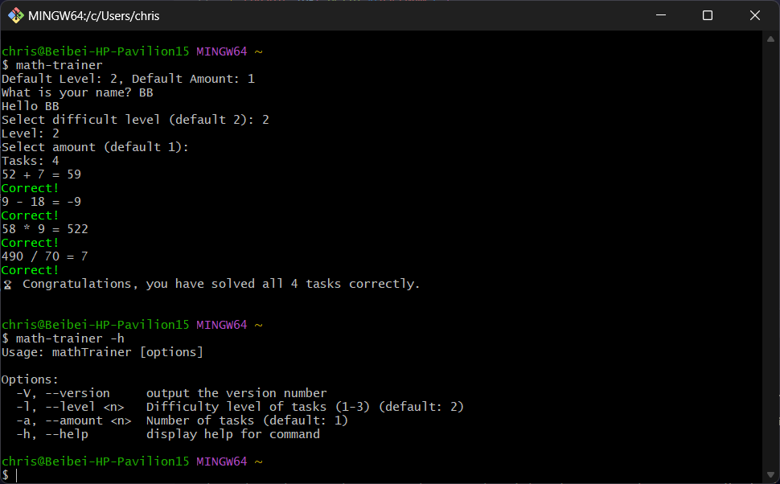

# Math Trainer (NodeJS)

## Overview
This CLI application is built-with NodeJS. A user can select difficult level and the amount of tasks.

## Built With
This project is built with Javascript, NodeJS.
- Javascript
- NodeJS
- Commander

## Live Demo

[]

## Features
- Defined user interaction with readline module.
- Set up CLI options and arguments using Commander package
- Cancel hander
- Using Chalk package to highlight colors
- Using node-emoji to output console emojis

## Reference
- The project is built upon 'math-trainer' app from 'Node.js - The Comprehensive Guide' authored by Sebastian Springer. User interaction questions have been added. Fixed errors of integer parser in [getOptions.js](./lib/getOptions.js). 

## License
The code is licensed under [Apache 2.0](https://www.apache.org/licenses/LICENSE-2.0.txt).

## Contact
- Beibei Yang [beibeiyang88@hotmail.com](mailto:beibeiyang88@hotmail.com)
